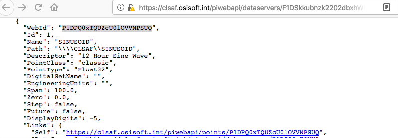
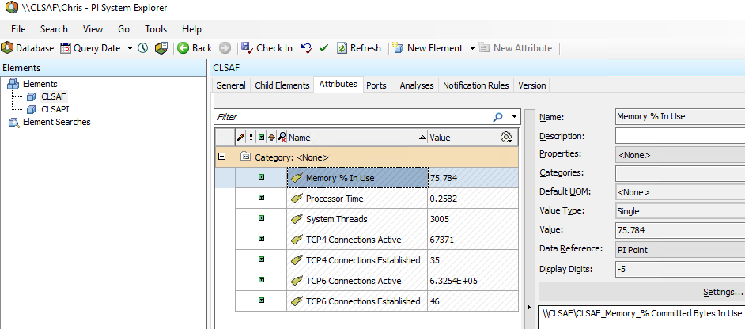
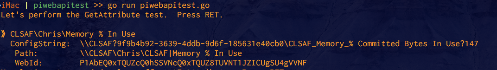
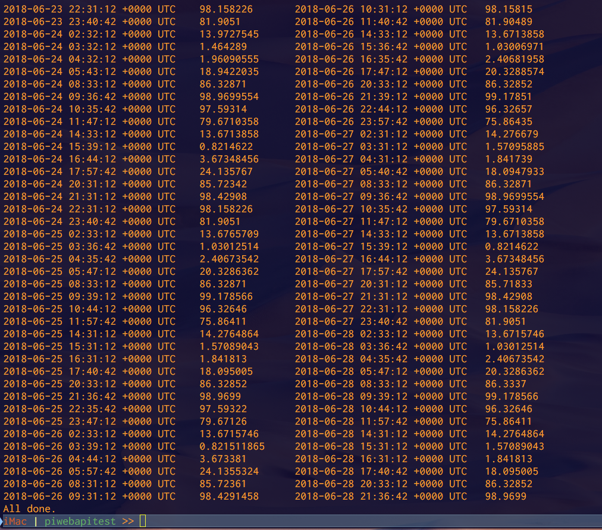
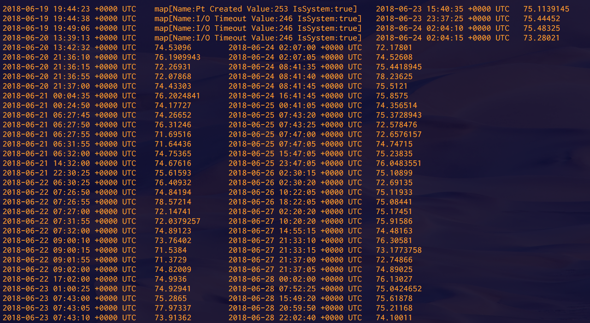
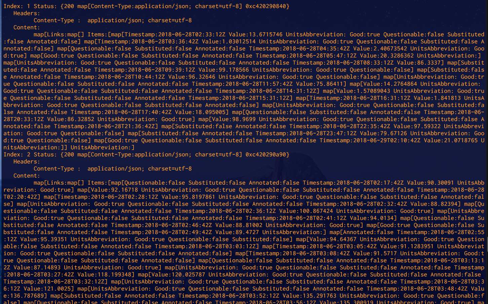
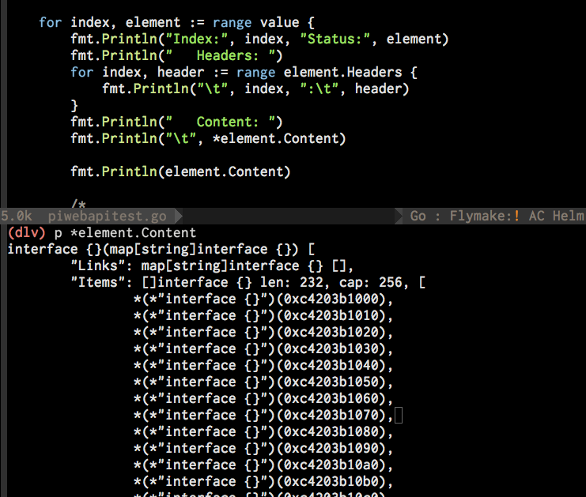
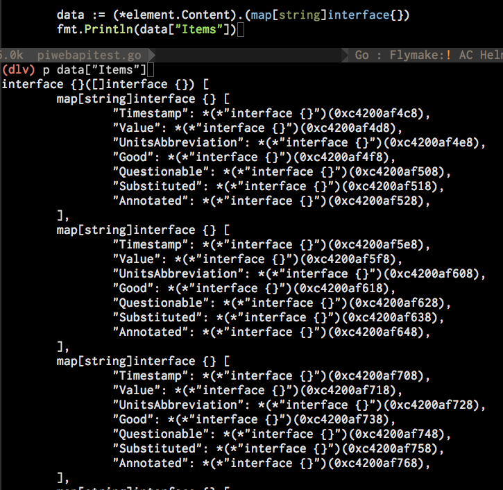

# Go PI Web API Examples

The examples I am about to show you will require a little bit of knowledge of how PI Web API works since we do not have a handy WebID builder *yet*.

If you're wondering what a WebID is, it's this static ID that's on all objects you put into the PI System.  See here:



You can get the [full Web ID 2.0 spec](https://pisquare.osisoft.com/community/developers-club/blog/2018/01/26/pi-web-api-web-id-20-specification-tables) on PI Dev Club as well as [a video and instructions](https://pisquare.osisoft.com/community/developers-club/blog/2018/01/26/pi-web-api-using-web-id-20-to-optimize-your-applications) on how to decode them.

## Setting up an HTTP Client
```go
package main

import (
	"context"
	"fmt"
	"io/ioutil"
	"log"

	pi "github.com/christoofar/gowebapi"
)

// The http client is best shared.
var cfg = pi.NewConfiguration()
var client *pi.APIClient
var auth context.Context

func Init() {
	cfg.BasePath = "https://myhostname.mycompany.com/piwebapi"
	//TODO Fix this
	auth = context.WithValue(context.Background(), pi.ContextBasicAuth, pi.BasicAuth{
		UserName: "COMPANY\MyID",
		Password: "p@$$w0rd",
	})
	client = pi.NewAPIClient(cfg)
}

func main() {
	Init()
}
```

Here I have stood up a global http client that is ready to send requests to the PI Web API endpoint.   I have replaced the "gowebapi" package name with the faster-to-type mnemonic called `pi`.

If you try to compile this, Go will immediately complain that the variable `auth` is not being used.   That's because it isn't.  It is the security context used to send stateless web requests.   To make the error go away we need to use `auth` in something.

## Getting an AF Attribute
At my office I have a AF database called `Chris` where I have some of my computers being monitored by PI Perfmon.  I would like to see the details about the Attribute I created called `Memory % In Use` hanging off a machine called CLSAF, which also happens to be my PI Server. 

**Keep in mine that my WebIDs will not work in your environment.  You can use a web browser to manually find the WebIDs in your system by going to https://youirserver/piwebapi.**




To get at that attribute's detail, let's call `AttributeGet`

```go
func GetAttribute() {

	// Construct the PathOnly WebID for \\CLSAF\Chris\CLSAF|Memory % In Use

	// See https://pisquare.osisoft.com/community/developers-club/blog/2018/01/26/pi-web-api-web-id-20-specification-tables
	webid := "P1AbE"     // <-- We're telling the server this is an AF Attribute hanging off an AF Element
	webid += "Q0xTQUZcQ0hSSVNcQ0xTQUZ8TUVNT1JZICUgSU4gVVNF" // CLSAF\CHRIS\CLSAF|MEMORY % IN USE
	options := make(map[string]interface{})
	options["webIdType"] = "PathOnly"

	value, resp, err := client.AttributeApi.AttributeGet(auth, webid, options)
	if err != nil {
		log.Println("The call to WebAPI failed [", resp.StatusCode, "]")
		body, _ := ioutil.ReadAll(resp.Body)
		log.Fatal(string(body))
	}

	fmt.Println("》CLSAF\\Chris\\Memory % In Use")
	fmt.Println("  ConfigString:\t", value.ConfigString)
	fmt.Println("   Path:\t", value.Path)
	fmt.Println("   WebId:\t", value.WebId)
}
```
Add a call to this `func` in your main() and then compile and run your program.  I've enhanced my program a bit more than the example, but you get the idea:


## Recorded Values (the PIPoint way)

Here's how to pull some recorded values out of a PI Point (aka "PI tag")

```go
func GetSiusoidTag() {

	webid := "P1DP"                // <-- This is a PI Point
	webid += "Q0xTQUZcU0lOVVNPSUQ" // <-- Whose path is CLSAF\SINUSOID
	optionals := make(map[string]interface{})

	optionals["startTime"] = "*-5d"
	optionals["endTime"] = "*"
	optionals["maxCount"] = int32(5000)

	value, resp, err := client.StreamApi.StreamGetRecorded(auth, webid, optionals)
	if err != nil {
		log.Fatal("Couldn't get PI tag CLSAF\\SINUSOID [", resp.StatusCode, "] ", err)
	}

	// Let us split the data that came back into 2 arrays then print in two columns in the console.
	col1 := value.Items[0 : len(value.Items)/2]
	col2 := value.Items[len(value.Items)/2:]

	for i := 0; i < len(col1); i++ {
		fmt.Println(col1[i].Timestamp, "\t", *col1[i].Value, "\t",
			col2[i].Timestamp, "\t", *col2[i].Value)
	}
}
```

Result:


## Recorded Values (the AF Attribute way)

Here's how to pull some recorded values out of an AF Attribute that has a DataReference.

```go
func GetRecordedValues() {
	webid := "P1AbE"     // <-- We're telling the server this is an AF Attribute hanging off an AF Element
	webid += "Q0xTQUZcQ0hSSVNcQ0xTQUZ8TUVNT1JZICUgSU4gVVNF" // CLSAF\CHRIS\CLSAF|MEMORY % IN USE
	optionals := make(map[string]interface{})

	optionals["endTime"] = "*"
	optionals["startTime"] = "*-100d"
	optionals["maxCount"] = int32(500)

	value, resp, err := client.StreamApi.StreamGetRecorded(auth, webid, optionals)
	if err != nil {
		log.Println("The call to WebAPI failed [", resp.StatusCode, "]")
		body, _ := ioutil.ReadAll(resp.Body)
		log.Fatal(string(body))
	}

	// Let us split the data that came back into 2 arrays to print in two columns in the console.
	col1 := value.Items[0 : len(value.Items)/2]
	col2 := value.Items[len(value.Items)/2:]

	for i := 0; i < len(col1); i++ {
		fmt.Println(col1[i].Timestamp, "\t", *col1[i].Value, "\t",
			col2[i].Timestamp, "\t", *col2[i].Value)
	}
}
```

Notice in the code that to retrieve the PIPoint values a pointer derefrence must occur.  Some variables in golang will be memory pointers which you must dereference.  Usually any variable that will accept a variety of structures will be by reference rather than by value.

A rule of thumb:  If you print a variable to the console and (0x00005244fff... is what you get back, you need to put a `*` in front of the variable to get at the array, map or struct that is behind it.

Result:


Notice how the Go `map` datatype is able to handle a mix of data value types coming back.  A `map` is a name:value pair data type in golang.  Not everything will be a floating point number.   This means you need to check what comes back.

## Batch Requests
Strangely enough these are the most simplest things in the world to implement in Go.

There's only one method `Execute` which takes an array of stuff.

Let's send two requests at once to pull recorded values from the server.  To implement the individual request batches we need to define a struct where we can put our batch request content, which I've called `BatchRequest`.  If I don't fill something out in the `BatchRequest` struct I want to make sure the JSON for the empty fields do not get set.  You can attach hints to struct fields like this:

```go

type BatchRequest struct {
	Resource string `json:"Resource,omitempty"`
	Method   string `json:"Method,omitempty"`
	Content  string `json:"Content,omitempty"`
}

func BatchExample() {

	webid := "F1DPkkubnzk2202dbxhWMeQMsAAQAAAAQ0xTQUZcU0lOVVNPSUQ" // SINUSOID
	webid2 := "F1DPkkubnzk2202dbxhWMeQMsAAwAAAAQ0xTQUZcQ0RUMTU4"   // CDT158

	batches := make(map[string]BatchRequest)
	
	// Setup request 1
	var batch1 BatchRequest
	batch1.Method = "GET"
	batch1.Resource = "https://localhost/piwebapi/streams/" + webid + "/recorded"

	// Setup Request 2
	var batch2 BatchRequest
	batch2.Method = "GET"
	batch2.Resource = "https://localhost/piwebapi/streams/" + webid2 + "/recorded"

	// Stick 'em in the map
	batches["1"] = batch1
	batches["2"] = batch2

	// Ship it!!!
	value, resp, err := client.BatchApi.BatchExecute(auth, batches)
	if err != nil {
		log.Fatal("Batch request failed.  [", resp.StatusCode, "] ", err)
	}

	// Succeeded, now process what we got back
	fmt.Println(value)
	fmt.Println("Request completed.")

}
```

Result:

```
map[1:{200 map[Content-Type:application/json; charset=utf-8] 0xc420304090} 
2:{200 map[Content-Type:application/json; charset=utf-8] 0xc420304220}]
Request completed.
~/go/piwebapitest $ 
```

As you can see, we got back a memory address for the data (0xc420304090 and 0xc420304220), which means we were given pointers to some structure since those are memory addresses.  Let's call `fmt.Println()` again but this time we will do a print of each dereferenced item inside the map.

```go
	// Succeeded

	for index, element := range value {
		fmt.Println("Index:", index, "Status:", element)
		fmt.Println("   Headers: ")
		for index, header := range element.Headers {
			fmt.Println("\t", index, ":\t", header)
		}
		fmt.Println("   Content: ")
		fmt.Println("\t", *element.Content)
	}
```	

Now, let's look at the output:


My that's a lot of output!  Since Batch output can be literally anything, you can use the Go Delve debugger to figure out the data structure that was returned to you in the `gowebapi.Response` type.

Let's change this routine so we loop through the information the server sent back.

```go

	for index, element := range value {
		fmt.Println("Index:", index, "Status:", element)
		fmt.Println("   Headers: ")
		for index, header := range element.Headers {
			fmt.Println("\t", index, ":\t", header)
		}
		fmt.Println("   Content: ")
		fmt.Println("\t", *element.Content)

		fmt.Println(*element.Content)
	}
```

By running the [Go Delve](https://github.com/derekparker/delve) debugger and setting a breakpoint at the last `Println` statement we can probe what the `Content` is.   It is this:



So it looks like for one of the two batches I got back 232 items.  We know they're time:value records from the PI Data Archive, but here we see yet more memory addresses.   So we need to deference these as well.   So let's do that, but to even get there we need to dereference the element list we have using a technique called [Type assertions](https://tour.golang.org/methods/15) which you can use to figure out what you have, like this:



Aha, the data is structured!  It looks like we get back several layers of nested maps, which the `json` library in Go converts to arrays of run-time interfaces.

But we're seeing more pointers to more dictionary values.   But that's easy, we can loop through these to print them all out, dereferenced.   But since they're hiding inside `interface{}` we'll have to use type assertions yet again to remind Go that we got back nested dictionaries of things.


My Batch can be complicated!  But it's all structured with references and it does take three levels of `for` loops to scan through all the results you got back--which is a perfect job for a goroutine to handle by itself.

Since Delve told me what type these arrays of things are, I used those hints from the debugger to write this code to exract out the data.
